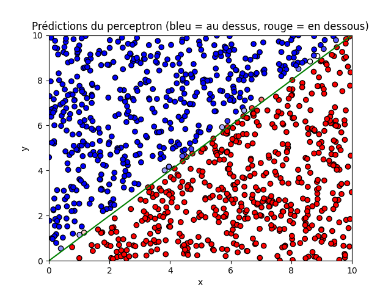
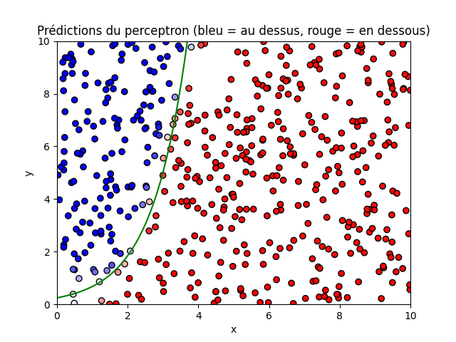

# 🧠 Neural Decoder for Quantum Error Correction

## 🚀 Introduction
This project explores the intersection between **machine learning** and **quantum error correction (QEC)**.  
It aims to demonstrate how a **neural network** can learn to **decode and correct quantum errors** from noisy measurement data.

We start from the basics — building a **perceptron** and a **multi-layer perceptron (MLP)** from scratch — before extending these concepts to a **decoder** capable of predicting optimal corrections in simple quantum codes such as the **3-qubit bit-flip code**.

📌 **Final objective**: Train a neural network to map **error syndromes** to **correction operations**, effectively simulating a *machine-learning-based quantum decoder*.

---

## 📚 Project Overview

### **1️⃣ Classical Neural Network Foundations**
Before applying machine learning to quantum systems, we first build and understand the fundamentals of classical neural networks.

- Implementation of a **simple perceptron** (binary classification in 2D) 
- Extension to a **multi-layer perceptron (MLP)** for more complex problems 
- Experimentation with architectures and learning parameters

**Goal:** Understand how neural networks learn and generalize decision boundaries.

---

### **2️⃣ Neural Decoder for Quantum Error Correction** *(Main Project)*
The core part of this repository focuses on **quantum error correction through supervised learning**.

- Simulation of the **3-qubit bit-flip code**
- Generation of **training data**: random errors and corresponding **syndromes**
- Training an **MLP** to predict which qubit was flipped based on the measured syndrome
- Evaluation of the model’s correction accuracy as a function of noise probability

**Goal:** Show that a neural network can *learn* the logical decoding rule of a quantum code.

#### 🔍 Possible extensions
- Add phase-flip or 5-qubit code simulations  
- Compare performance to ideal (analytical) decoding  
- Explore **reinforcement learning** for adaptive error correction  

---

### **3️⃣ Classical Image Classification** *(my Personal Bonus)*
As an optional exploration, the project can include a small image classification demo to test the MLP architecture on standard data before applying it to quantum decoding.

---

## 🧠 Conceptual Connection
Quantum error correction aims to **stabilize quantum information** against noise and decoherence.  
A **decoder** takes the *measured syndrome* (partial information) and decides which correction to apply.

Machine learning offers an alternative: instead of designing the decoder manually, we **train** a neural network to *infer* optimal corrections from data, an approach related to **feedback control** and **reinforcement learning** techniques discussed by *Dr. Giovanni Cemin (MPIPKS)* in his Quant25 talk *“Reinforcement Learning to Stabilize Nonequilibrium Phases of Matter.”*

---

## 🛠 Repository Structure

```
📂 neural-network/
│
├── 📂 introduction/
│   │
│   ├── 📂 perceptron/
│   │   ├── perceptron.py         ← Perceptron Classe
│   │   ├── utils.py              ← Fonctions auxiliaires (visualisation, métriques...)
│   │   ├── main.py               ← Main script (data + learning + plot)
│   │   │
│   │   └── 📂 results/
│   │       ├── perceptron-animation-evolution.py    ← Script pour voir l'évolution de l'apprentissage d'un perceptron
│   │       ├── perceptron-training-evolution.mp4       
│   │       └── perceptron-result.png 
│   │
│   ├── 📂 multi-layer-perceptron/
│   │   ├── layer.py              ← Classe layer pour ce qui se passe dans une couche
│   │   ├── mlp.py                ← Classe du reseau entier
│   │   ├── utils.py              ← Fonctions auxiliaires (visualisation, métriques...)
│   │   ├── main.py               ← Main script (data + learning + plot)
│   │   │
│   │   └── 📂 results/
│   │       └── multi-layer-perceptron-result.png
│   │
│   └── 📜 README.md              ← readme associate to the introduction project 
│
├── 📂 quantum-decoder/
│   ├── data_generation.py ← simulate bit-flip code and generate training samples
│   ├── decoder_mlp.py ← neural network model for decoding
│   ├── train_decoder.py ← training and evaluation script
│   ├── plots.py ← visualization utilities (accuracy vs noise rate)
│   │
│   └── 📂 results/
│       └── decoder_accuracy.png
│
├── 📄 RL_talk_note_Quant25.pdf   ← Notes from Cemin's Talk about RL
│
└── 📜 README.md                  ← (this file)
```

## ⚙️ Installation & Dependencies

1. **Clone this repository**
```bash
git clone https://github.com/theohuetqc/neural-network.git
cd neural-network
```

2. **Install Python dependencies**
```bash
pip install numpy matplotlib torch qiskit
```

---

## 🚧 Progress (Soon)
| Task                                         | Status         |
| -------------------------------------------- | -------------- |
| Implemented perceptron                       | ✅              |
| Implemented customizable MLP                 | ✅              |
| Add bit-flip code simulator                  | 🔄 In progress |
| Train neural decoder (syndrome → correction) | 🔄 Planned     |
| Visualize decoder performance                | 🔄 Planned     |
| (Optional) Image classification demo         | ⏸ Optional     |

---

## 🧾 References
- Giovanni Cemin (MPIPKS), "Reinforcement learning to stabilize nonequilibrium phases of matter with active feedback using partial information", Quant25 Conference, 2025.
- Related work: “Entanglement Transitions in Unitary Circuit Games”, ResearchGate, 2024
- [My notes from Cemin's Talk](RL_talk_note_Quant25.pdf)
